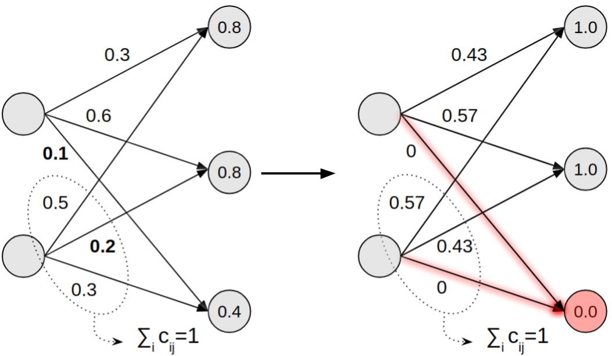
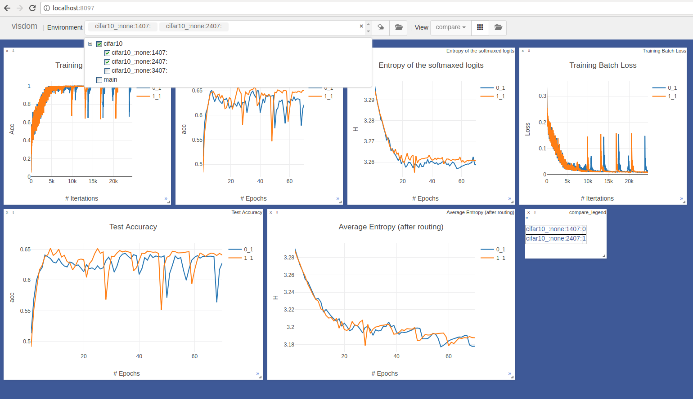

# Sparse Capsule Networks



This repository contains the PyTorch project used in the experiments in my master thesis on Sparse Capsule Networks (SCNs).

* [Getting Started](#getting-started)
* [Project Overview](#project-overview)
* [Running Experiments](#running-experiments)
* [Using Visdom](#using-visdom)

## Getting Started

These instructions will guide you by the setup of the project and allow training the default settings.

#### Prerequisites 


```bash
# make sure a recent version of conda is installed (>4.4.10) 
conda --version

# clone this repository. 
git clone git@github.com:mavanb/sparse_capsule_networks.git

# create a new conda environment
conda create --name name_environment python=3.6

# activate the enviroment
source activate name_environment
```

#### Installing

To install using only CPU support. 

`python setup.py install`

To install with GPU support. 

`python setup.py install --torch_source True --folder "/torch_folder`

where `torch_folder` is the folder where the source code of source will be stored. 

Check if install of all packages was successful.

`python setup.py test`

#### Running default settings

To train a SCN with the default parameters. Make sure the created conda environment is active. 

`python train_capsnet.py` 

## Project Overview

The main modules in this project are: 
* [nets.py](./nets.py): all networks or models used
* [layers.py](./layers.py): all layers used in the networks 
* [loss.py](./loss.py): extended margin loss
* [utils.py](./utils.py): utilities
* [train_capsnet.py](./train_capsnet.py): train an instance of the BasicCapsNet

To handle the PyTorch training process, we use [ignite](https://github.com/pytorch/ignite). All supporting modules are 
in [ignite_features](ignite_features_old) package. [trainer.py](ignite_features_old/trainer.py) contains the abstract 
Trainer class. It adds all commonly used handlers and supports a train, validation and test step. Other trainers (such 
the CapsuleTrainer), extend this class and implement the train, valid and test functions. Optionally add custom handlers. 
Other modules are: 
* [plot_handlers.py](ignite_features_old/plot_handlers.py) handles to make standard visdom plots
* [metric.py](ignite_features_old/metric.py) custom ignite metrics 
* [log_handlers.py](ignite_features_old/log_handlers.py) all handlers used for logging
* [handlers.py](ignite_features_old/handlers.py) general handlers

The default configurations files are placed in the [configurations](./configurations) package. 
[conf.py](./configurations/conf.py) processes these files. 

The data is downloaded to the [data](./data) package. [data_loader.py](./data/data_loader.py) creates a
[torchvision](https://pytorch.org/docs/stable/torchvision/index.html) Dataset instance. 

## Running Experiments 

#### Run a new experiment

To run a new experiment.

```bash
# make folder in the experiments folder
mkdir experiments/newexp

# copy the default configs 
cp configurations/general.conf  experiments/newexp/
cp configurations/capsnet.conf  experiments/newexp/
```

Change the configurations files to the required settings. These settings are kept constant during the experiment. Make 
sure in general.conf the experiment name points to the right experiment: 

`exp_name = newexp`

Run the experiment and point to the correct configuration files. Configurations that are varied in the experiments can 
passed as commandline arguments. Make sure the model name describes the varied parameters. It is advised to use a bash 
script. The test accuracy on the best validation epoch and the model name are logged to a csv. Example:

`python train_capsnet.py --general_conf experiments/newexp/general.conf --capsule_conf experiments/newexp/capsnet.conf --routing_iters 2 --model_name mnist_rout_2`

#### Run an existing experiment

To run an existing experiment, for example 'diff_sparse'.

```bash
# navigate to folder
cd experiments/diff_sparse

# run the experiment as defined in the bash script 
./run.sh
```


## Using Visdom



[Visdom](https://github.com/facebookresearch/visdom) is used to plot and log the metrics. To use visdom, make sure that 
the general.conf file contains:

```bash
start_visdom = True
use_visdom = True
```

Or set start_visdom to False and start visdom manually: 

`python -m visdom.server -env_path ./experiments/newexp`

During training navigate to [http://localhost:8097](http://localhost:8097) to follow the training process. All visdom files are written to the env_path (generally the experiment folder) for later analysis. 